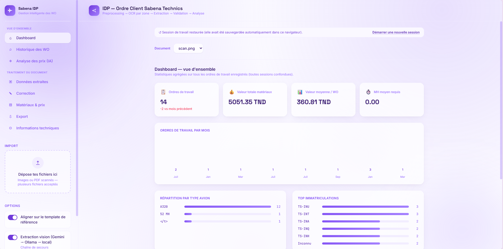
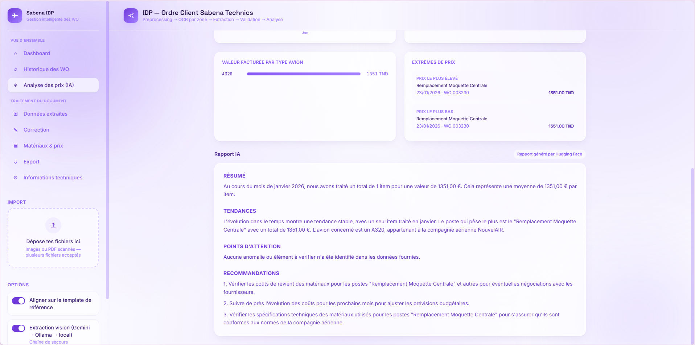
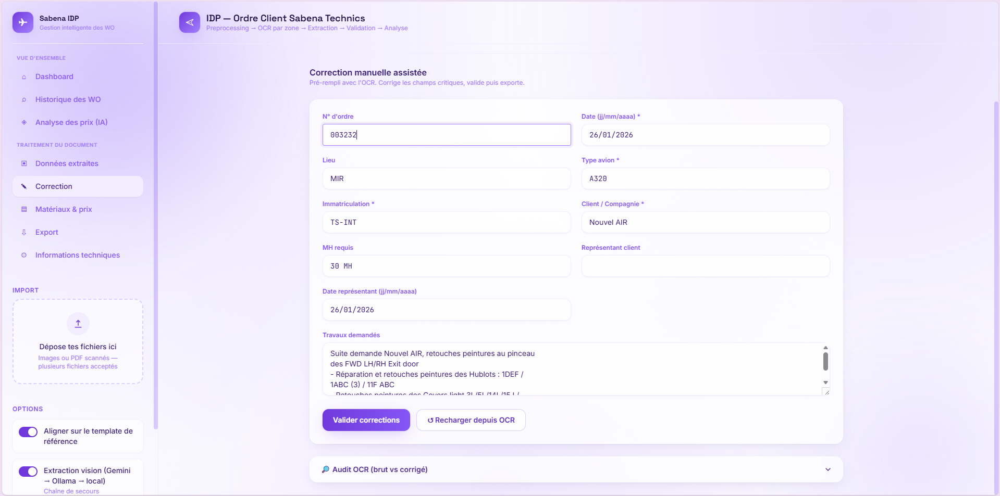
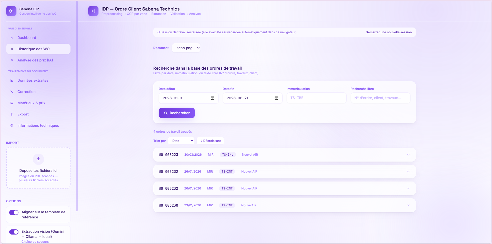

# Nouvelair WO IDP — Extraction intelligente des bons de travail

Pipeline de traitement intelligent de documents (IDP) pour les bons de travail
(Work Orders) de maintenance aéronautique de Sabena Technics : OCR, extraction
de champs, validation, base de données et analyse, avec une interface web
moderne (Next.js).

Le projet a deux moitiés qui communiquent par HTTP :

```
┌─────────────────────────┐        HTTP        ┌──────────────────────────┐
│   Backend Python         │◄────────────────►│   Frontend Next.js        │
│   (racine du repo)       │   localhost:8000   │   sabena-nextjs/          │
│   FastAPI + pipeline OCR │                     │   Interface utilisateur  │
└─────────────────────────┘                     └──────────────────────────┘
```

---

## Captures d'écran

| Dashboard | Analyse des prix (IA) |
|---|---|
|  |  |

| Correction manuelle | Recherche / Historique des WO |
|---|---|
|  |  |

---

## Fonctionnalités

- **Extraction automatique** de bons de travail scannés (image ou PDF) :
  détection de document, redressement/alignement sur template, OCR par zone
  (Tesseract + TrOCR pour les champs manuscrits), extraction vision par LLM
  (Gemini par défaut), validation croisée.
- **Correction manuelle** des champs extraits, avec suivi de confiance par
  champ et par composante du pipeline.
- **Gestion des matériaux & prix** vendus par bon de travail (ajout,
  suppression, édition).
- **Base de données SQLite** : sauvegarde, recherche (par date, immatriculation,
  texte libre), historique des bons de travail.
- **Dashboard** : statistiques agrégées sur l'ensemble des bons de travail
  enregistrés (volumes, valeurs, répartition par mois/avion/immatriculation).
- **Analyse des prix par IA** : statistiques + diagrammes sur une période
  donnée, accompagnés d'un rapport en langage naturel généré par un LLM
  (Hugging Face, avec repli automatique sur Ollama local puis un résumé
  template si aucun LLM n'est joignable).
- **Mode démo** : si le backend Python n'est pas joignable, le frontend
  bascule automatiquement sur des données simulées pour rester utilisable
  (utile pour une démo sans backend, ou pendant le développement front seul).

---

## Architecture du pipeline d'extraction

```
Image/PDF → Prétraitement → Détection & alignement template → OCR par zone
   → Extraction (règles + LLM vision) → Validation (règles + LLM) → JSON structuré
```

**Chaîne de fournisseurs LLM, avec repli automatique en cascade** — le
principe appliqué partout dans le projet : toujours essayer le meilleur
outil pour la tâche, ne jamais bloquer si un service est indisponible.

| Usage | Fournisseur principal | Repli 1 | Repli final |
|---|---|---|---|
| **Extraction vision** (lecture des documents) | Gemini (`gemini-3.6-flash`) | Ollama local | Pipeline 100% local (TrOCR + Tesseract + règles) |
| **Validation croisée** | Gemini | — | Validation par règles uniquement |
| **Rapport d'analyse des prix** (texte seul) | Hugging Face (`Llama-3.1-8B-Instruct`) | Ollama local | Résumé généré par template (sans LLM) |

> **Pourquoi Gemini pour l'extraction mais Hugging Face pour le rapport de
> prix ?** L'extraction lit des images (manuscrit + tableaux denses) : c'est
> une tâche de vision où la précision compte directement (montants, dates,
> immatriculations). Gemini y est nettement plus fiable que les modèles
> vision actuellement disponibles via Hugging Face. Le rapport de prix, à
> l'inverse, ne traite que du texte (des statistiques déjà calculées côté
> Python) — une tâche de rédaction où un modèle Hugging Face plus léger et
> gratuit fait très bien l'affaire, sans dépendre de Gemini pour tout.

---

## Installation

### Prérequis

- Python 3.11+
- Node.js 18+
- [Tesseract OCR](https://github.com/tesseract-ocr/tesseract) installé sur le système
  (utilisé par `pytesseract`)
- (Optionnel) [Ollama](https://ollama.com/download) installé en local, pour le
  repli 100% hors-ligne
- Une clé API gratuite [Gemini](https://aistudio.google.com/apikey) (extraction)
- Une clé API gratuite [Hugging Face](https://huggingface.co/settings/tokens)
  (rapport d'analyse des prix)

### 1. Backend Python

```bash
# Depuis la racine du repo
pip install -r requirements.txt

cp .env.example .env
# Édite .env et renseigne au minimum GEMINI_API_KEY et HF_TOKEN

uvicorn api_server:app --reload --port 8000
```

L'API tourne sur `http://localhost:8000`. Documentation interactive (Swagger)
disponible sur `http://localhost:8000/docs`.

### 2. Frontend Next.js

```bash
cd sabena-nextjs
cp .env.local.example .env.local   # NEXT_PUBLIC_API_URL=http://localhost:8000
npm install
npm run dev
```

Ouvre `http://localhost:3000`.

> Si le backend n'est pas lancé, l'interface bascule automatiquement en
> **mode démo** (données simulées) plutôt que d'afficher une erreur — un
> badge discret dans l'en-tête l'indique.

---

## Variables d'environnement (`.env`, racine)

| Variable | Requise | Usage |
|---|---|---|
| `GEMINI_API_KEY` | Oui | Extraction vision + validation ([clé gratuite](https://aistudio.google.com/apikey)) |
| `HF_TOKEN` | Recommandée | Rapport d'analyse des prix ([clé gratuite](https://huggingface.co/settings/tokens)) |
| `ANTHROPIC_API_KEY` | Optionnelle | Uniquement si `VISION.provider = "claude"` dans `configs/config.py` |

Sans ces clés, le pipeline continue de fonctionner grâce aux replis locaux
(Ollama si installé, sinon Tesseract/TrOCR/template pour l'extraction, et un
résumé template pour le rapport de prix) — jamais d'erreur bloquante.

---

## Structure du projet

```
.
├── api_server.py            # Serveur FastAPI (endpoints REST)
├── db.py                    # Schéma & requêtes SQLite (work_orders, materials)
├── requirements.txt
├── configs/
│   └── config.py            # Toute la configuration (OCR, vision, LLM, seuils...)
├── app/
│   ├── main.py               # Orchestration du pipeline d'extraction
│   ├── preprocessing/        # Prétraitement image (deskew, contraste...)
│   ├── classification/       # Détection & alignement du template
│   ├── ocr/                  # Moteurs OCR (Tesseract, TrOCR)
│   ├── extraction/           # Extraction vision LLM (Gemini/Claude/Ollama), validation
│   ├── postprocessing/       # Nettoyage & normalisation des champs extraits
│   ├── analysis/             # Analyse des prix (statistiques + rapport LLM)
│   ├── evaluation/           # Scoring de confiance
│   └── utils/                # Logger, helpers I/O
├── data/
│   ├── templates/            # Templates de référence pour l'alignement
│   ├── test_set/             # Jeu de test annoté
│   └── sabena_wo.db          # Base SQLite (générée automatiquement, non versionnée)
├── tests/                    # Tests unitaires (pytest)
├── tools/
│   └── calibrate_roi.py      # Outil Streamlit de calibration des zones OCR
└── sabena-nextjs/            # Frontend Next.js — voir sabena-nextjs/README.md
```

---

## Tests

```bash
pytest tests/
```

---

## Outils annexes

**Calibration des zones OCR** (`tools/calibrate_roi.py`) : interface Streamlit
pour ajuster visuellement les régions d'intérêt (ROI) sur le template de
référence.

```bash
streamlit run tools/calibrate_roi.py
```

**Debug du pipeline** (`debug_pipeline.py`) : exécute chaque étape du
prétraitement individuellement et sauvegarde les images intermédiaires dans
`debug_out/` (non versionné) pour diagnostiquer un problème d'OCR.

```bash
python debug_pipeline.py <chemin_image>
```
